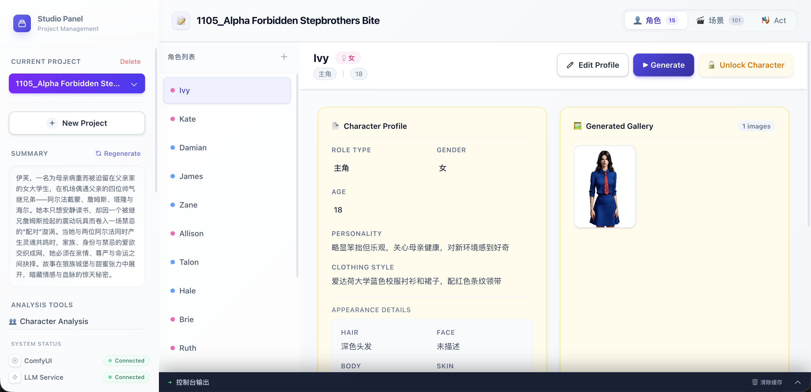
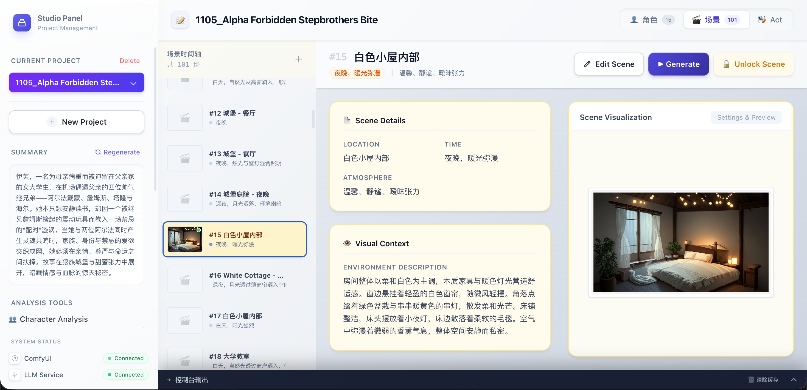

# 🎬 筑梦视界: AI 驱动的导演助手

<div align="center">

**将剧本转化为视觉杰作，且保持高度一致性**

[功能特性](#-功能特性) • [效果展示](#-效果展示) • [技术栈](#-技术栈) • [快速开始](#-快速开始)

[**English Documentation**](./README.md)

</div>

---

## 🚀 项目概述

**Dream Stage (筑梦视界)** 不仅仅是一个生成式工具，它是专为影视创作者、分镜师和预演团队打造的 **AI 导演助手**。

我们致力于填补剧本文字与视觉制作之间的鸿沟。通过智能分析剧本、提取角色特征并生成高度一致的场景图，我们帮助创作者在开机拍摄前就能精准预视故事画面。

我们的核心优势是 **精细的流程管理 (Precise Workflow Management)** —— 这带来了 **高度的可操控性** 与 **角色和场景的一致性**，确保创作者能精准还原脑海中的画面。

## ✨ 功能特性

### 🎭 角色一致性与“定角”机制
告别随机生成的角色面孔。
- **角色分析**: 自动从剧本中提取角色的外貌、性格和服装特征。
- **定角 (Finalize)**: 当你生成了一个满意的角色形象，点击 **"定角"**。
- **稳定生成**: 系统由于锁定角色的身份特征（人脸、风格、服装），确保他在第一场戏和第一百场戏中长得一模一样。

### 🎬 导演工作台 (Director's Workbench)
像在片场一样调度你的戏份。
- **拖拽排戏**: 将“已定角”的演员拖入舞台。
- **场面调度**: 视觉化地安排角色站位、道具摆放，定义画面构图。
- **可控生成**: 系统将严格遵循你的布局（基于 ControlNet/IPAdapter），生成完全符合导演意图的场景图。

### 🧠 智能剧本分析
- **深度理解**: 基于 LLM (Ollama/LMStudio) 理解剧本的上下文、潜台词和氛围。
- **流式分析**: 像打字机一样，实时逐行展示剧本分析结果。
- **结构拆解**: 自动将剧本拆分为剧幕 (Acts)、场次 (Scenes) 和节拍 (Beats)。

### 📱 多端支持
- **Web & Mobile**: 既可以在大屏上进行精细的导演工作，也可以在移动端随时审阅资产。

## 📸 效果展示

> 体验一致性角色生成与场景调度的力量。

### 工作台预览


### 一致性演示


## 🛠️ 技术栈

- **Frontend**: React, TypeScript, TailwindCSS, Zustand
- **Backend**: Python, FastAPI, Server-Sent Events (SSE)
- **AI Core**: 
    - **LLM**: Ollama / LMStudio (剧本逻辑)
    - **Vision**: ComfyUI (图像/视频生成)

## 🗺️ 开发进度 (Roadmap)

### 🛠️ 功能开发
- [x] 后端服务架构
- [x] 文本分析
- [x] 图像生成
- [ ] 关键帧生成
- [ ] 视频生成

### ⚡ 生成式流程
- [x] 文本分析流程
- [x] 图像生成流程
- [x] 图像合成流程
- [x] 视频合成流程

### 🎨 交互设计
- [x] PC浏览器页面设计
- [ ] 移动端页面设计

## 🏁 快速开始

1. **克隆仓库**
   ```bash
   git clone https://github.com/saiyeux/ScriptConverter.git
   ```
2. **安装后端依赖**
   ```bash
   cd backend && pip install -r requirements.txt
   ```
3. **启动前端**
   ```bash
   cd frontend && npm install && npm run dev
   ```

---
<div align="center">
为讲故事的人而设计。由 Dream Stage 团队用心打造。
</div>
